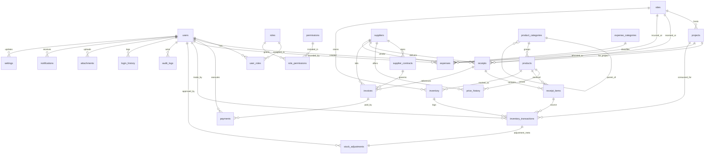

# ER Diagram (Complete)

```mermaid
erDiagram
    users ||--o{ user_roles : has
    roles ||--o{ user_roles : assigned_to
    roles ||--o{ role_permissions : grants
    permissions ||--o{ role_permissions : included_in

    sites ||--o{ projects : hosts

    suppliers ||--o{ supplier_contracts : signs
    product_categories ||--o{ product_categories : parent_of
    product_categories ||--o{ products : groups

    products ||--o{ price_history : priced
    suppliers ||--o{ price_history : offers

    suppliers ||--o{ receipts : delivers
    sites ||--o{ receipts : received_at
    projects ||--o{ receipts : for_project
    users ||--o{ receipts : created

    receipts ||--o{ receipt_items : contains
    products ||--o{ receipt_items : received

    suppliers ||--o{ invoices : bills
    supplier_contracts ||--o{ invoices : governs
    receipts ||--o{ invoices : references

    invoices ||--o{ payments : paid_by
    users ||--o{ payments : executes

    expense_categories ||--o{ expenses : classifies
    sites ||--o{ expenses : incurred_at
    projects ||--o{ expenses : allocated_to
    suppliers ||--o{ expenses : vendor
    users ||--o{ expenses : recorded_by

    sites ||--o{ inventory : stores
    products ||--o{ inventory : tracked_as

    inventory ||--o{ inventory_transactions : logs
    receipt_items ||--o{ inventory_transactions : source
    projects ||--o{ inventory_transactions : consumed_for
    users ||--o{ inventory_transactions : made_by

    inventory_transactions ||--|| stock_adjustments : adjustment_meta
    users ||--o{ stock_adjustments : approved_by

    users ||--o{ audit_logs : actor
    users ||--o{ login_history : logs
    users ||--o{ attachments : uploads
    users ||--o{ notifications : receives
    users ||--o{ settings : updates
```
